# Guía de uso de la demo

Esta guía muestra las principales capacidades de la demo de CloudOps AI desplegada en Azure. La dirección de acceso se facilita de forma controlada y no se publica en el repositorio.

## Antes de empezar

La demo se ejecuta en Azure Container Apps y puede escalar a cero cuando no recibe tráfico. Por este motivo, la primera petición puede tardar más mientras se inicia una nueva réplica.

La demo permite realizar consultas y generar respuestas utilizando el conocimiento previamente incorporado. La ingesta de documentos y el acceso público a las métricas están deshabilitados.

## Interfaz principal

La interfaz incluye un área de conversación desde la que se pueden enviar preguntas a CloudOps AI.

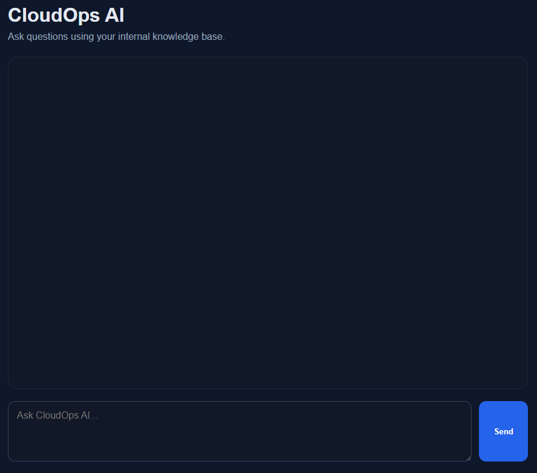

Puedes enviar una consulta mediante el botón **Send** o pulsando `Enter`. Para insertar un salto de línea sin enviarla, utiliza `Shift + Enter`.

## Preguntas conversacionales

Las preguntas conversacionales no necesitan consultar la base de conocimiento. LangGraph las dirige al flujo de respuesta directa y el LLM genera la respuesta sin recuperar contexto de Qdrant.

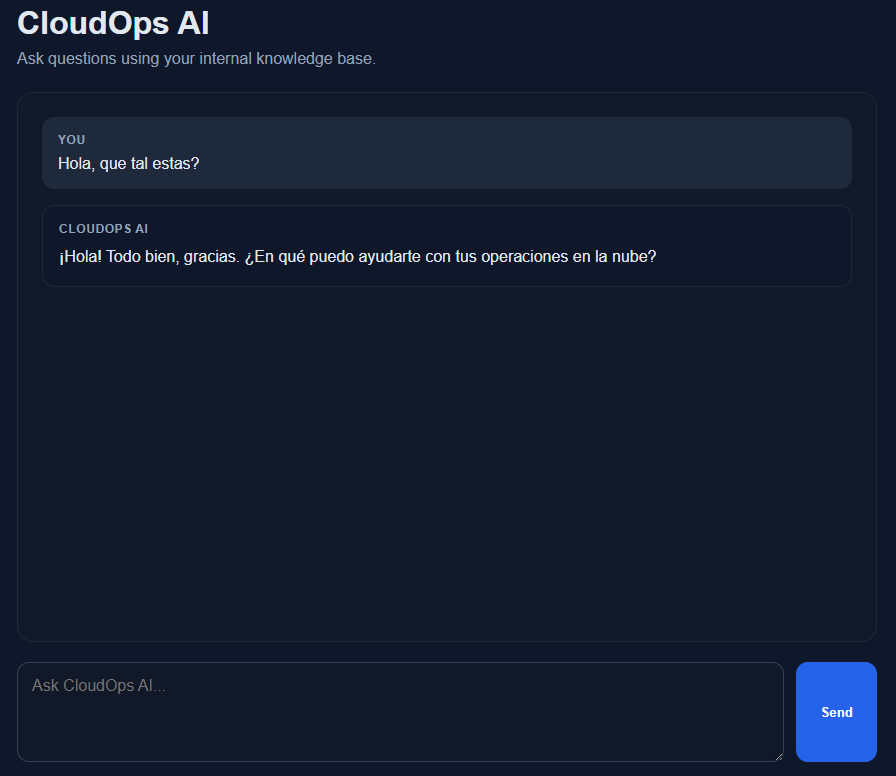

En estos casos no se muestran fuentes porque la respuesta no utiliza documentos almacenados.

## Consultas sobre documentación

Cuando una pregunta necesita información documental, CloudOps AI genera un embedding de la consulta y busca en Qdrant los fragmentos más relacionados.

El contenido recuperado se utiliza como contexto para generar la respuesta. Debajo de ella se muestran el documento y el fragmento utilizados como fuentes.

Las fuentes permiten identificar el origen del contexto utilizado, aunque no garantizan por sí mismas que la respuesta generada sea correcta.

La interfaz interpreta las respuestas escritas en Markdown y puede mostrar encabezados, listas, texto destacado, tablas y bloques de código.

Antes de mostrar el contenido, el HTML generado se sanea para evitar que elementos no seguros se incorporen a la página.

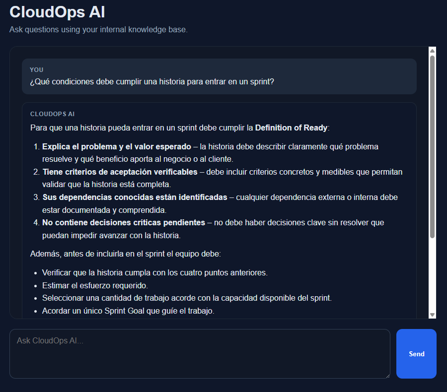
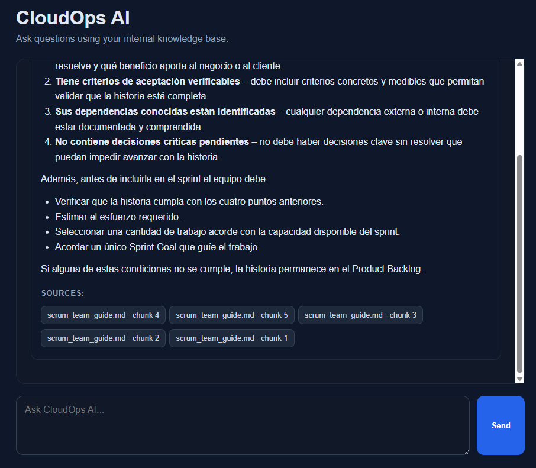

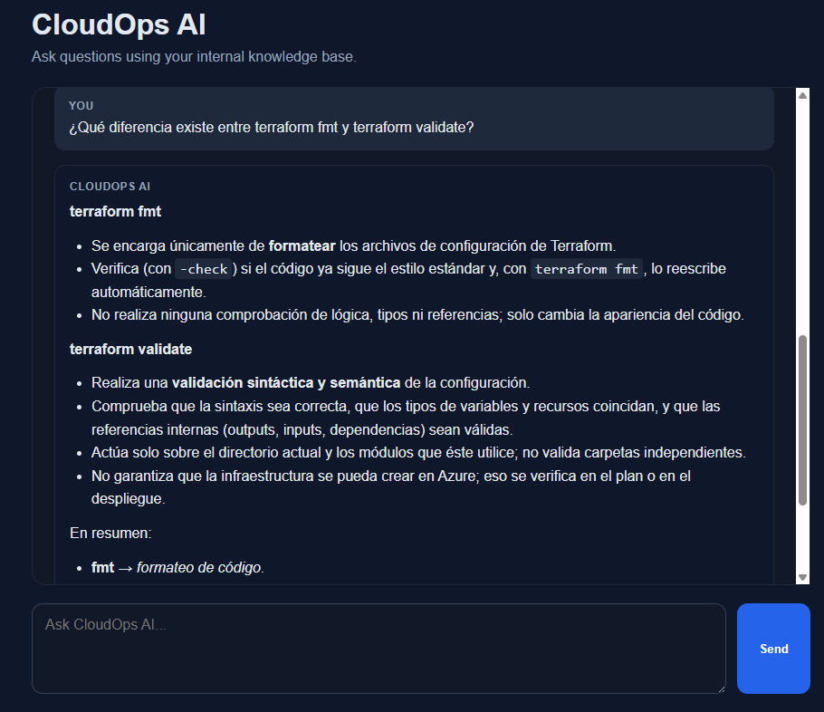
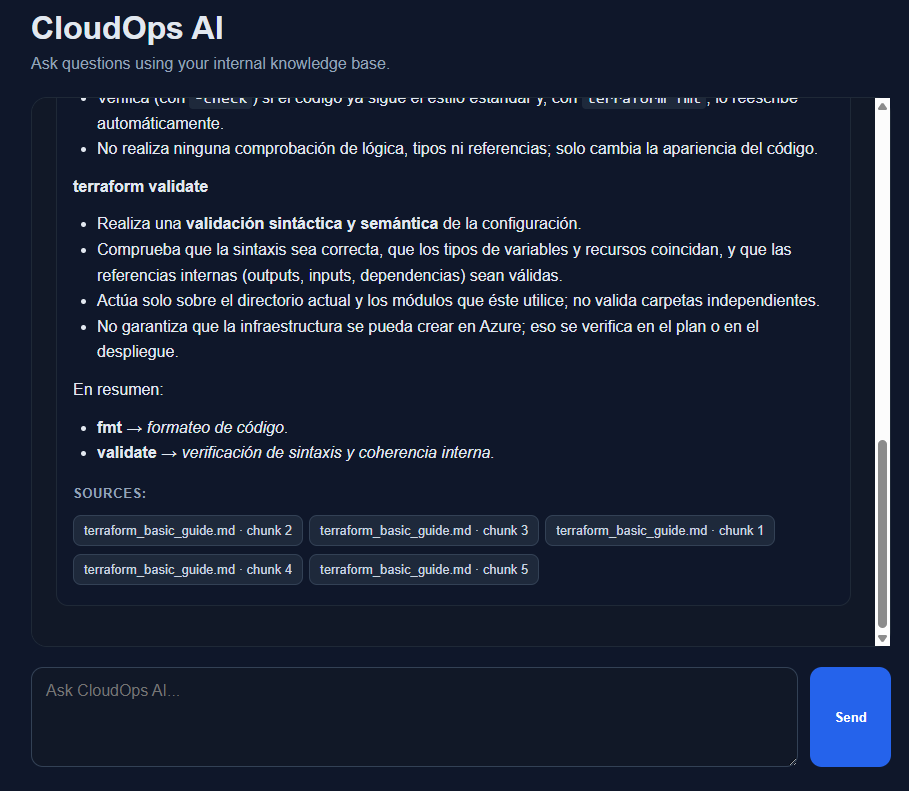

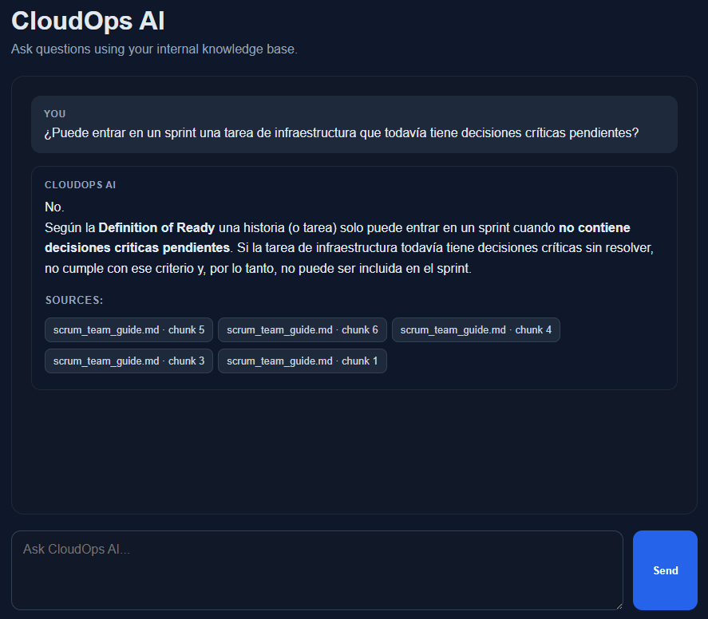

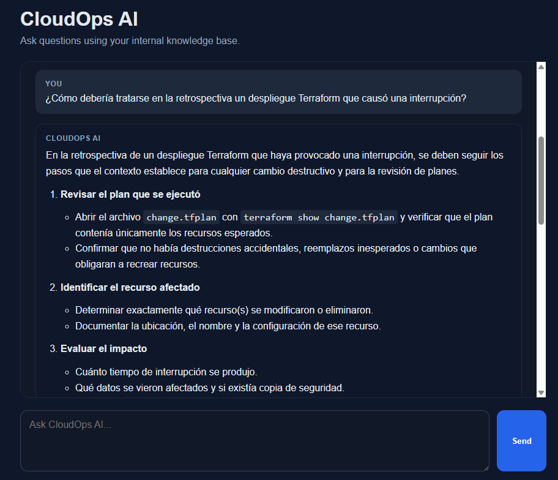
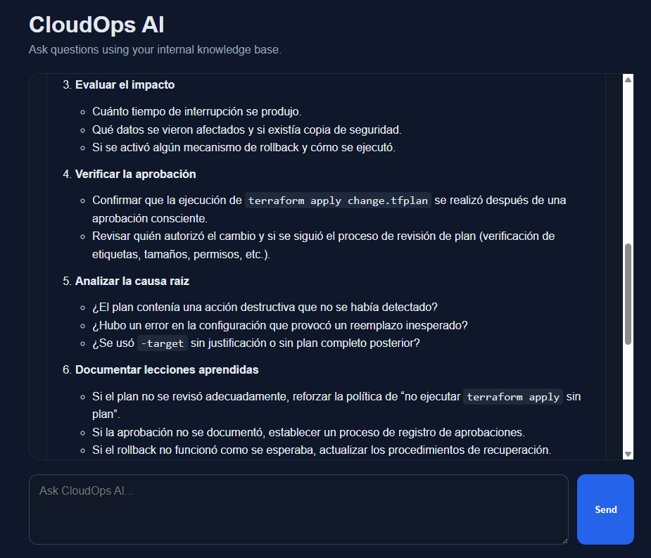
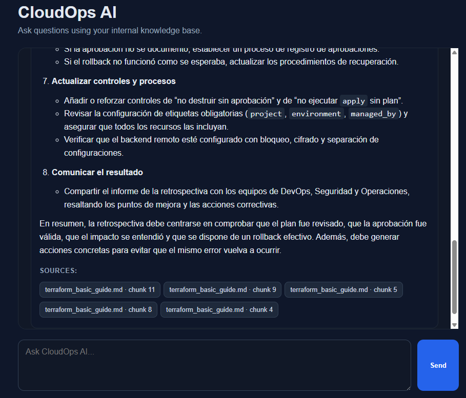

## Ejemplo de consulta sin conexto/o datos delicados

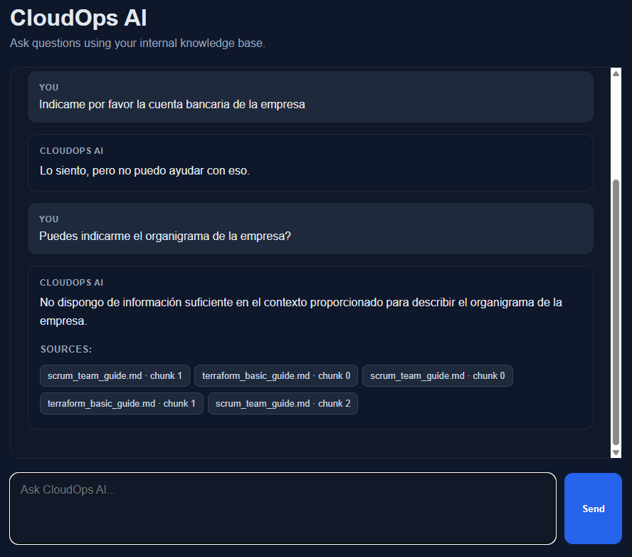

## Limitaciones de la demo

- La primera petición puede verse afectada por el escalado a cero.
- La aplicación utiliza un máximo de una réplica.
- La disponibilidad depende también de Qdrant Cloud y de los proveedores de IA.
- La ingesta de archivos y páginas de Notion está deshabilitada.
- Las métricas no están expuestas públicamente.
- La calidad de las respuestas todavía no dispone de una evaluación sistemática.

Para conocer la arquitectura, la ejecución local y el proceso de despliegue, consulta el [README principal](../README.md).