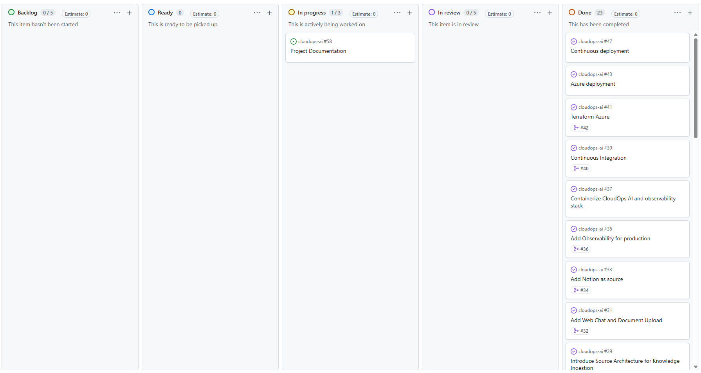
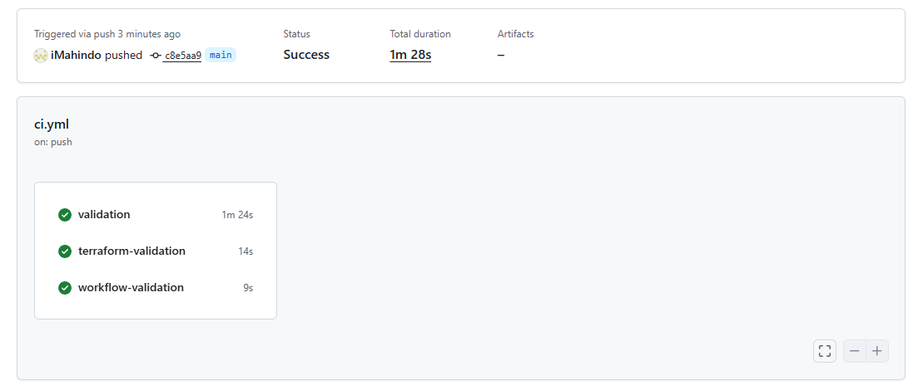
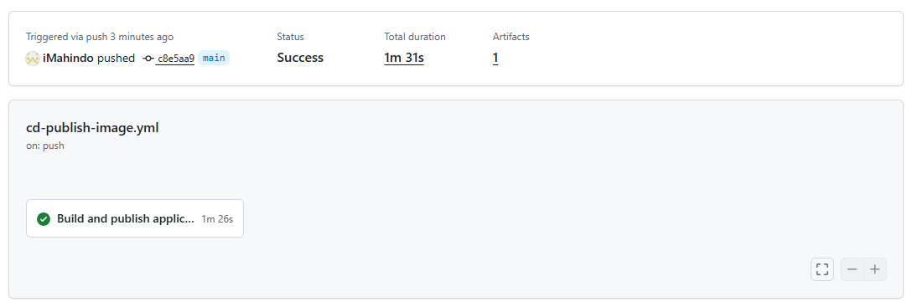
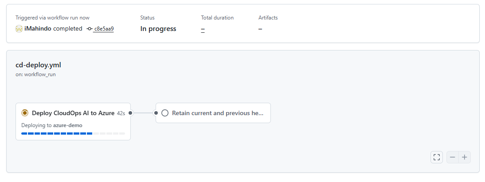

# Gestión y entrega del proyecto

CloudOps AI se desarrolla de manera incremental mediante GitHub Issues, GitHub Projects, ramas de trabajo y Pull Requests.

## Organización del trabajo

GitHub Projects se utiliza para organizar el roadmap, dividir el desarrollo en sprints y seguir el estado de cada tarea. Las issues describen el objetivo y el alcance de cada cambio antes de comenzar su implementación.



## Flujo de trabajo

Cada cambio sigue normalmente este recorrido:

```text
Issue
→ rama de trabajo
→ implementación y validación local
→ push
→ Draft Pull Request
→ CI
→ revisión
→ aceptación de merge manual (human in the loop)
→ validación en main
→ eliminación de la rama
```

Las Pull Requests mantienen el contexto del cambio, las decisiones tomadas y los resultados de las comprobaciones automáticas.

## Automatización con GitHub Actions

El repositorio utiliza tres workflows principales:


| Workflow    | Cuándo se ejecuta                    | Finalidad                                                                                        |
| ----------- | ------------------------------------ | ------------------------------------------------------------------------------------------------ |
| CI          | Pull Requests y cambios en `main`    | Validar Docker Compose, salud de la API, Ruff, pytest, Terraform, scripts y workflows            |
| Publicación | Cambios relevantes en `main`         | Construir y publicar una imagen identificada con el SHA del commit                               |
| Despliegue  | Publicación completada correctamente | Actualizar la Container App, comprobar su salud y verificar que Terraform queda sin diferencias. |


### Integración continua



### Publicación de la imagen



### Despliegue en Azure



Los workflows utilizan permisos separados y autenticación OIDC para acceder a Azure sin almacenar credenciales permanentes. La implementación completa puede consultarse en `[.github/workflows](../.github/workflows)`.